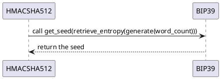

# BIP39 generator

## Authors

Forked from [Jose Luu](https://github.com/jluuM2) repository [project_blockchain_python](https://github.com/jluuM2/projet_blockchain_python)

The dev team is :
- [Estelle Hu](https://github.com/EstelleHu)
- [Mengru Gao](https://github.com/Mengrulune)
- [Alexandre Chekroun](https://github.com/alchekroun)

## History of version

 Format : X.Y.Z

X : Major release, many new features

Y : Minor release, few features on a previous major release

Z : Fix for a minor release

- 1.0.0 : implementation of the BIP39 generator
- 1.1.0 : adding tests function

## Context
This BIP describes the implementation of a mnemonic code for the generation of deterministic wallets.

It consists of two parts: Generation of the mnemonic sentence and its conversion into a binary seed. This seed can later be used to generate deterministic wallets using BIP39 or similar methods.

Our library implements a [BIP39 generator](https://github.com/bitcoin/bips/blob/master/bip-0039.mediawiki) in C++. Fully workable on a python3 environment.

## Interaction with other components


## Python functions
- ```get_langage()``` : Returns the language of the component.
- ```set_language(string language)``` : Sets the language of the component to French with parameter **"fr"** or to English with parameter **"en"**.
- ```generate(int word_count)``` : Generates the mnemonic sentence with **word_count** of words. **word_count** can only be chosen in the list [12, 15, 18, 21, 24].
- ```generate_given_entropy(string entropy)``` : Generate the mnemonic sentence given an entropy.
- ```retrieve_entropy(string mnemonic_sentence)```: Retrieve entropy given a mnemonic sentence.
- ```get_entropy()``` : Returns the entropy of the object bip39.

## Installation

Initialize dependencies:
```bash
cd project_blockchain_python
git submodule init
git submodule update
```
Then compile:
```bash
cd bip39
make
```

## Usage

Open a python3 console and import the library:

```python
>>> import bip39 as bp
>>> gen = bp.Bip39("en") # By default "en"
>>> gen.generate(12)
'also lab path phrase inner magic metal expose involve roof hire spell'
>>>
```

You can change the langage in the constructor or with the function ```set_langage("fr")```

## Test
In order to check our component is working properly we have written a test code (more detaiks in bip39.cpp) with the following methods.

```generate_entropy()```: returns a random string

```generate_checksum(std::string& entropy_string)```: returns a string of the combination of entropy string with the checksum 

```generate_mnemonic(std::string& checksum_string)```: returns a string of mnemonic

```Bip39::generate(int word_count)```:returns a sentence of words which correspond to the mnemonic

```Bip39::verify_mnemonic(std:: string& entropy_string, std::string& mnemonic_sentence)```: returns the result of test with type bool

Plan of test:
1. To check all the arguments are right
2. To check the length of entropy
3. To check the sentence of mnemonic with expected sentence

The method ```verify_mnemonic``` will retrun ```TRUE``` if the signature is valid. If not, return ```FALSE```. It takes two argument, the entropy string, and the mnemonic sentence.


## Exceptions
You can only generate X words, with X in [12, 15, 18, 21, 24].
```python
>>> gen.generate(30)
Traceback (most recent call last):
  File "<stdin>", line 1, in <module>
ValueError: The number of words wanted must be in [12, 15, 18, 21, 24] interval
```
